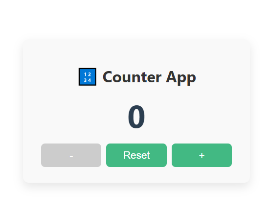

# 🔢 Vue 3 Counter App

A simple and clean counter app built with **Vue 3 Composition API** and **vanilla CSS**. Designed as a learning project to explore Vue’s core concepts like reactivity, event handling, and component structure.

## 🚀 Features

- Increase, decrease, and reset the counter
- Prevents negative count
- Responsive, clean UI with vanilla CSS
- Built using Vue 3 and Composition API

## 🛠 Tech Stack

- [Vue 3](https://vuejs.org/)
- Composition API (`<script setup>`)

## 🧪 Demo
clone and run it locally 👇

## 💻 Getting Started

### 1. Clone the repo

```bash
git clone https://github.com/YOUR_USERNAME/vue-counter-app.git
cd counter-app
```
### 2. Install dependencies

```bash
npm install
```
### 3. Start development server

```bash
npm run dev
```
Visit http://localhost:5173 in your browser 🚀

## 🤓 What I Learned

- Creating reactive variables using ref()
- Vue event binding with @click
- Two-way binding in templates
- Building with the Composition API in Vue 3



---

Made with ❤️ while learning Vue 3